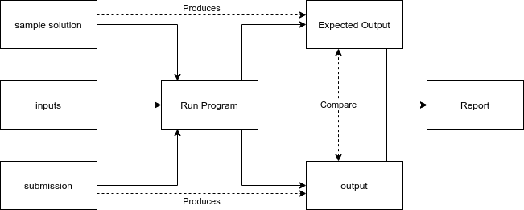

# Automarker
### Inspired by University of Cape Town's Computer Science coding questions Automarking tool.

## Logic

### Run Program
Core function that runs java code and produces an output based on the code given to it with a set of **inputs** used.
#### Sample Solution
Question specific solution code to generate **Expected Output**.
#### Submission
User submitted code that generates **output**.
### Report
For specific question, compares **Expected Output** with user **output** and compiles a report indicating input provided, expected output, user output and correctness. 